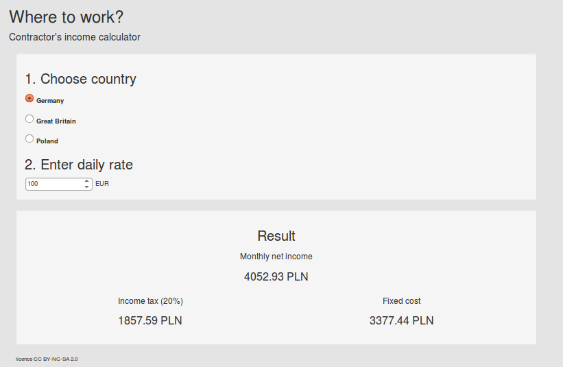

# Where to work?
 This is demo web application for contractor's income calculations.

 This Spring Boot + AngularJS project and was created with JHipster (Yeoman).


 
# Overview

## Usage
1. Choose country (to work) 
* Enter daily rate 
* Read monthly net income (without tax income and fixed cost)



## How to run

[Installation process](https://jhipster.github.io/installation.html)

You can launch the Java server with Maven: mvn 

You can use Grunt to work on the client-side JavaScript application: grunt 

If you want to use it with use the pre-configured "prod" Maven profile: mvn -Pprod spring-boot:run 

## Frontend components
- [main.html](src/main/webapp/scripts/app/main/main.html)
- [main.controller.js](src/main/webapp/scripts/app/main/main.controller.js)
- [incomePart.directive.js](src/main/webapp/scripts/app/income/incomePart.directive.js)
- [incomeService.js](src/main/webapp/scripts/app/income/incomeService.js)

## Backend components
- [CountryResource](src/main/java/pl/hexmind/wtw/web/rest/CountryResource.java)
- [IncomeResource](src/main/java/pl/hexmind/wtw/web/rest/IncomeResource.java)
- [CountryRepository](src/main/java/pl/hexmind/wtw/service/income/CountryRepository.java)
- [IncomeCalculatorService](src/main/java/pl/hexmind/wtw/service/income/IncomeCalculatorService.java)
- [IncomeCalculationPolicy](src/main/java/pl/hexmind/wtw/service/income/IncomeCalculationPolicy.java)
- [CountryCostService](src/main/java/pl/hexmind/wtw/service/income/CountryCostService.java)
- [CurrencyConverter](src/main/java/pl/hexmind/wtw/service/exchange/CurrencyConverter.java)
- [FixerExchangeRateService](src/main/java/pl/hexmind/wtw/service/exchange/FixerExchangeRateService.java)

## Domain model
- [Money](src/main/java/pl/hexmind/wtw/model/Money.java)
- [Country](src/main/java/pl/hexmind/wtw/model/Country.java)
- [CountryCost](src/main/java/pl/hexmind/wtw/model/CountryCost.java)
- [MonthlyIncome](src/main/java/pl/hexmind/wtw/model/MonthlyIncome.java)

## Tests
- [shouldConvertFromEuroToPln](src/test/java/pl/hexmind/wtw/service/CurrencyConverterTest.java)
- [shouldCalculateMonthlyIncome](src/test/java/pl/hexmind/wtw/service/IncomeCalculationPolicyTest.java)
- [shouldFindCoutryCost](src/test/java/pl/hexmind/wtw/service/CountryCostServiceTest.java)
- [shouldFindAllCountries](src/test/java/pl/hexmind/wtw/service/CountryRepositoryTest.java)

# Configuration

## Currency conversion
Currency converion is realised by [Fixer.io](http://fixer.io/). This is a free JSON API for with rates published by the European Central Bank.
For change 3rd party exchange rates provider you should implement ExchangeRateService interface.

## Properties
You can override java properties in [many ways](http://docs.spring.io/spring-boot/docs/current/reference/html/boot-features-external-config.htm)

src/main/resources/config/application.yml

```
app:
    default:
        country: PL
    constants:
        workdaysInMonth: 22
```
## More countries
It is possible to simple add new one or more countries:
```
country:
  name:
    FR: France
  currency:
    FR: EUR
  fixed:
    FR: 900
  tax:
    FR: 0.20
```

# Roadmap
1. clean unused components
* internationalization
* add target currency select to GUI